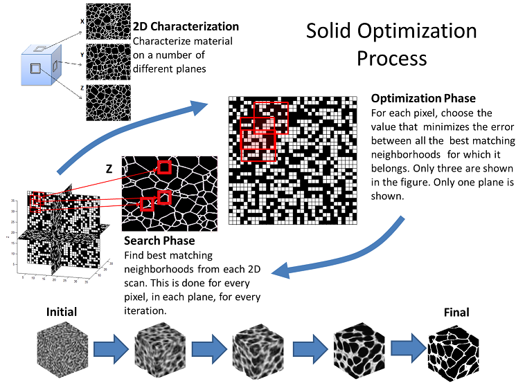
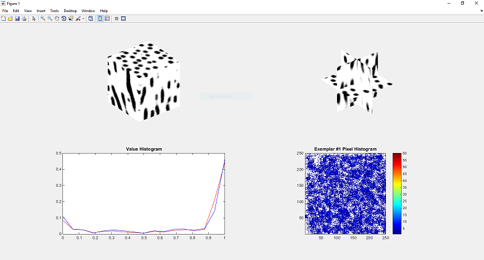

# Microstructure Maker

Microstructure Maker is a A MATLAB\C++ implementation of solid texture synthesis algorithms for constructing statistically representative 3D microstructure datasets from only 2D data. This software attempts to create 3D reconstructions of microstructures from a limited number of oblique 2D sections\images. If your are studying a material system where it is difficult or impossible to apply 3D characterization techniques (X-Ray microtomography, serial sectioned SEM, etc.) then Microstructure Maker may enable you to get a 3D volumentric picture of your material system from your 2D images.

## Methods

The methods used by our software were inspired by the field of solid texture synthesis, a sub-domain of computer graphics. Our goal was to make these methods applicable to real material datasets so that researchers could have an alternative approach to expensive and limited 3D characterization techniques. These methods attempt to solve the ill-posed optimization problem of finding a 3D reconstruction that best matches the microstructure statistics present in a limited number of 2D exemplars (images) taken from oblique sections. While these methods can be very effective they do have some limitations. First, the microstructure that you wish to reconstruct must be statistically homogenous. Second, you must have a significant amount of computational resources on your machine to run these algorithms in addition to some patience. Finally, they are not guaranteed to converge to a global optimum and thus they are sensitive to initial parameters. 



## Usage

To get started there are a few requirments. 

- Microstructure Maker is a hybrid MATLAB\C++ program. Portions of the code were programmed in C++ to ensure optimal efficiency. These portions must be compiled into MEX binaries before the code can be executed in the MATLAB environment. Assuming you have appropriatley configured a C++ compiler with your MATLAB evironment using `mex -setup`, the MEX files can be built with:

```matlab
cd src/matlab
build_mex
```

- Microstructure Maker makes heavy use of approximate nearest neighbor (ANN) searching. To accomplish this we have leveraged the wonderful work of Marius Muja and David Lowe, specifically, their software called FLANN (https://github.com/mariusmuja/flann). We use the MATLAB MEX bindings of this project so these must be on your path or you will receive and error. 

- Finally, to run and example simply execute:

```matlab
RunReconTest
```

If everything goes smoothly you should eventually see and figure output that shows the progress of the reconstruction optimization that looks something like this:



## Limitations

- Currently, Microstructure Maker only supports binary (2-phas images). Very minor modifications can be made to support greyscale images and will be done soon. In the future, we will concentrate on support for polycrystalline datasets.

- These methods are computationally intensive. We suggest a machine with a minimum of 4 cores and at least 16 GB of memory. This will allow reconstructions of at least 100^3 voxels.

## References
- David M. Turner, Surya R. Kalidindi, Statistical construction of 3-D microstructures from 2-D exemplars collected on oblique sections, Acta Materialia, Volume 102, 1 January 2016, Pages 136-148, ISSN 1359-6454, http://dx.doi.org/10.1016/j.actamat.2015.09.011.
(http://www.sciencedirect.com/science/article/pii/S1359645415006771)
- Johannes Kopf, Chi-Wing Fu, Daniel Cohen-Or, Oliver Deussen, Dani Lischinski, and Tien-Tsin Wong. 2007. Solid texture synthesis from 2D exemplars. ACM Trans. Graph. 26, 3, Article 2 (July 2007). DOI: https://doi.org/10.1145/1276377.1276380
- Chen, Jiating, and Bin Wang. "High quality solid texture synthesis using position and index histogram matching." The Visual Computer 26.4 (2010): 253-262.
